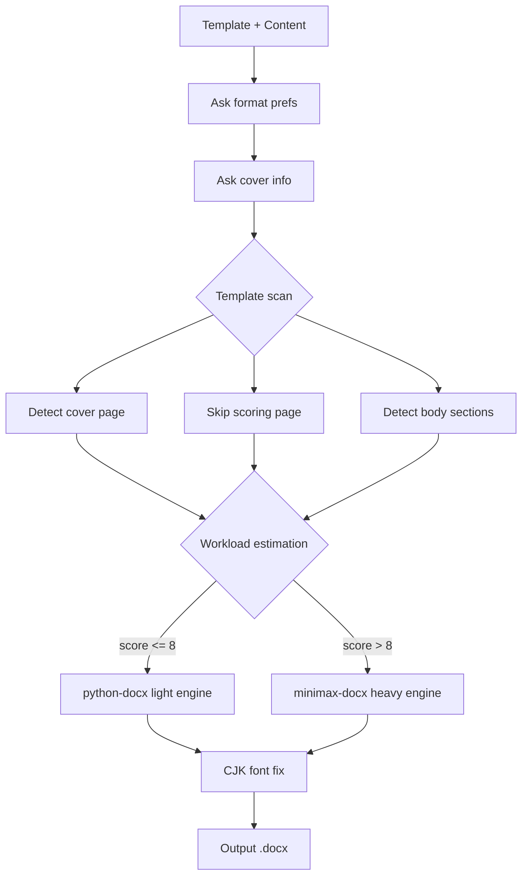

# wordhelp

Dual-engine Word document processing — **python-docx** for quick edits, **minimax-docx** for professional output.

## Architecture



## Demo

```console
$ powershell scripts/smoke-test.ps1
=== wordhelp Smoke Test ===
[1/3] Python + python-docx... OK (1.2.0)
[2/3] .NET SDK... OK (8.0.407)
[3/3] WPS COM... WARN (optional)
All checks passed!

$ powershell scripts/estimate-workload.ps1 -P 50 -T 5 -C 30 -Type academic
engine=minimax-docx; score=13

$ dotnet run --project MiniMaxAIDocx.Cli -- create --type report --title "wordhelp Sample"
Created report document: demo/sample-report.docx

Sections: 1 | Paragraphs: 1 | Tables: 0 | Images: 0 | Custom styles: 0
```

## Dependencies

| Component | Purpose | License |
|-----------|---------|---------|
| [python-docx](https://github.com/python-openxml/python-docx) | Light engine | MIT |
| [minimax-docx](https://github.com/MiniMaxAI/minimax-docx) | Heavy engine | MIT |
| Python 3.10+ | Runtime | - |
| .NET SDK 8.0+ | minimax-docx runtime | MIT |

## Copyright

Engine routing and template analysis logic partially inspired by WorkBuddy (Tencent/CodeBuddy) built-in skills.

Underlying dependencies python-docx and minimax-docx retain their original MIT licenses.

SKILL.md and all auxiliary scripts are original to this project, released under MIT.

## Quick Start

```powershell
# 1. Environment check
powershell scripts/smoke-test.ps1

# 2. Build minimax-docx backend (first time only)
powershell scripts/build-minimax.ps1

# 3. Convert .doc file
powershell scripts/convert-doc.ps1 -InputPath template.doc

# 4. Fix CJK/EN fonts
powershell scripts/fix-cjk-fonts.ps1 -InputPath output.docx

# 5. Estimate workload and auto-select engine
powershell scripts/estimate-workload.ps1 -P 50 -T 5 -C 30 -Type academic
```
