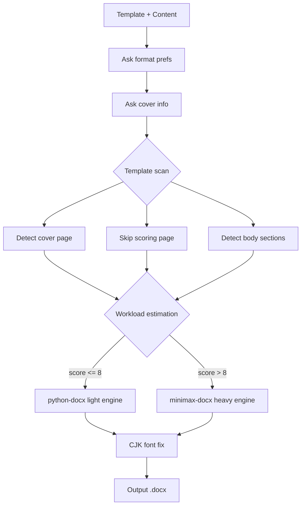

https://github.com/Sty102437/wordhelp/blob/master/README.md
# wordhelp

Dual-engine Word document processing — **python-docx** for quick edits, **minimax-docx** for professional output. Cross-platform (Windows / macOS / Linux).

## Quick Install

```bash
# Install dependencies
pip install -r requirements.txt

# Full install (checks env + builds minimax-docx)
python scripts/install.py

# Minimal install (python-docx only, skip minimax-docx)
python scripts/install.py --minimal
```

**Windows alternative:**
```powershell
powershell -ExecutionPolicy Bypass -File scripts\install.ps1
powershell -ExecutionPolicy Bypass -File scripts\install.ps1 -Minimal
```

## Architecture



## Dependencies

| Component | Purpose | License | Install |
|-----------|---------|---------|---------|
| [python-docx](https://github.com/python-openxml/python-docx) | Light engine | MIT | `pip install -r requirements.txt` |
| [pywin32](https://github.com/mhammond/pywin32) | .doc conversion (Windows only) | BSD | Auto via requirements.txt |
| minimax-docx | Heavy engine | MIT | Codex/Trae/WorkBuddy skill marketplace |
| .NET SDK 8.0+ | minimax-docx runtime | MIT | https://dotnet.microsoft.com |
| WPS Office / Word | .doc conversion (Windows) | - | Optional |
| LibreOffice | .doc conversion (all platforms) | MPL | Optional |

## Cross-Platform .doc Conversion

The converter auto-detects available tools:

| Platform | Priority |
|----------|----------|
| Windows | WPS COM → Word COM → LibreOffice CLI |
| macOS | LibreOffice CLI |
| Linux | LibreOffice CLI |

## Environment Variables (optional)

| Variable | Default | Purpose |
|----------|---------|---------|
| `WORDHELP_MINIMAX_SKILL` | auto-detected | minimax-docx skill directory |

## Copyright

Engine routing and template analysis logic partially inspired by WorkBuddy (Tencent/CodeBuddy) built-in skills.

Underlying dependencies python-docx and minimax-docx retain their original MIT licenses.

SKILL.md and all auxiliary scripts are original to this project, released under MIT.
