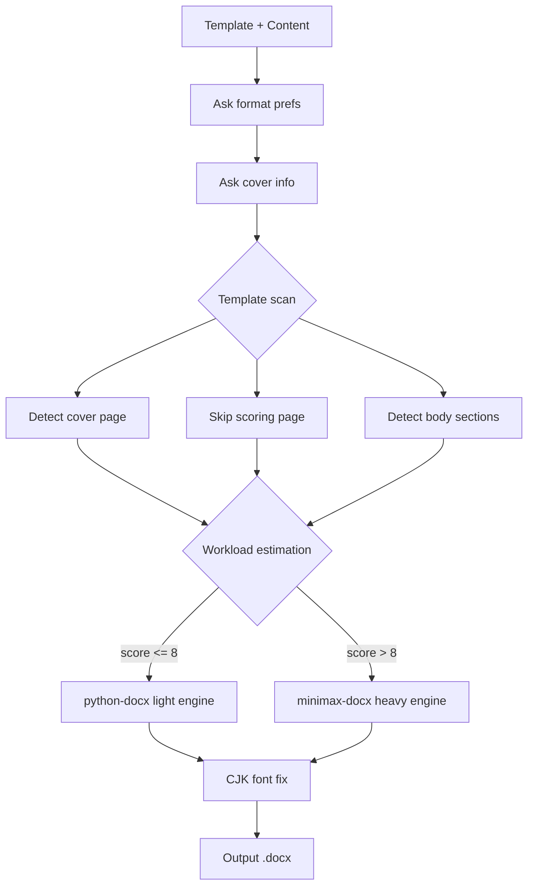
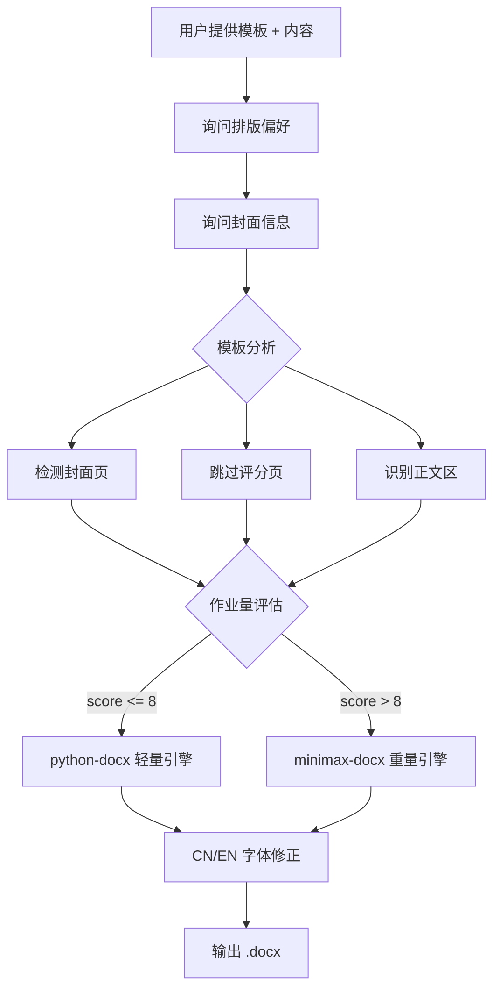

# wordhelp

Dual-engine Word document processing — **python-docx** for quick edits, **minimax-docx** for professional output. Cross-platform (Windows / macOS / Linux).

---

## Quick Install

```bash
pip install -r requirements.txt
python scripts/install.py          # full install
python scripts/install.py --minimal  # python-docx only
```

**Windows PowerShell:**
```powershell
powershell -ExecutionPolicy Bypass -File scripts\install.ps1
powershell -ExecutionPolicy Bypass -File scripts\install.ps1 -Minimal
```

## Architecture



## Dependencies

| Component | Purpose | License | Install |
|-----------|---------|---------|---------|
| [python-docx](https://github.com/python-openxml/python-docx) | Light engine | MIT | `pip install -r requirements.txt` |
| [pywin32](https://github.com/mhammond/pywin32) | .doc conversion (Windows) | BSD | Auto via requirements.txt |
| minimax-docx | Heavy engine | MIT | Codex/Trae/WorkBuddy marketplace |
| .NET SDK 8.0+ | minimax-docx runtime | MIT | https://dotnet.microsoft.com |
| WPS Office / Word | .doc conversion (Windows) | - | Optional |
| LibreOffice | .doc conversion (all platforms) | MPL | Optional |

## Cross-Platform .doc Conversion

| Platform | Auto-detect priority |
|----------|---------------------|
| Windows | WPS COM → Word COM → LibreOffice CLI |
| macOS | LibreOffice CLI |
| Linux | LibreOffice CLI |

Specify a preferred converter in Phase 0 to skip auto-detection:

```bash
python scripts/convert_doc.py --input template.doc --converter wps
```

## Environment Variables

| Variable | Default | Purpose |
|----------|---------|---------|
| `WORDHELP_MINIMAX_SKILL` | auto-detected | minimax-docx skill directory |

## Copyright

Engine routing and template analysis logic partially inspired by WorkBuddy (Tencent/CodeBuddy) built-in skills. Underlying engines python-docx and minimax-docx retain their original MIT licenses. SKILL.md and all auxiliary scripts are original to this project, released under MIT.

---

# wordhelp（中文）

双重引擎的 Word 文档处理工具——轻活快刀 **python-docx**，重活重剑 **minimax-docx**。跨平台支持（Windows / macOS / Linux）。

## 一键安装

```bash
# 安装依赖
pip install -r requirements.txt

# 完整安装（检查环境 + 构建 minimax-docx）
python scripts/install.py

# 最小安装（仅 python-docx，跳过 minimax-docx）
python scripts/install.py --minimal
```

**Windows 用户也可用 PowerShell：**
```powershell
powershell -ExecutionPolicy Bypass -File scripts\install.ps1
powershell -ExecutionPolicy Bypass -File scripts\install.ps1 -Minimal
```

## 架构



## 依赖

| 组件 | 用途 | 许可 | 安装方式 |
|------|------|------|----------|
| [python-docx](https://github.com/python-openxml/python-docx) | 轻量引擎 | MIT | `pip install -r requirements.txt` |
| [pywin32](https://github.com/mhammond/pywin32) | .doc 转换（仅 Windows） | BSD | requirements.txt 自动安装 |
| minimax-docx | 重量引擎 | MIT | Codex/Trae/WorkBuddy skill 市场 |
| .NET SDK 8.0+ | minimax-docx 运行时 | MIT | https://dotnet.microsoft.com |
| WPS Office / Word | .doc 转换（Windows） | - | 可选 |
| LibreOffice | .doc 转换（全平台） | MPL | 可选 |

## 跨平台 .doc 转换

转换器自动检测可用工具：

| 平台 | 优先级 |
|------|--------|
| Windows | WPS COM → Word COM → LibreOffice CLI |
| macOS | LibreOffice CLI |
| Linux | LibreOffice CLI |

在 Phase 0 指定偏好工具可跳过自动检测：

```bash
python scripts/convert_doc.py --input template.doc --converter wps
```

## 环境变量

| 变量 | 默认值 | 用途 |
|------|--------|------|
| `WORDHELP_MINIMAX_SKILL` | 自动检测 | minimax-docx skill 目录 |

## 版权声明

本项目的引擎路由策略和模板分析逻辑，部分借鉴了 WorkBuddy（Tencent/CodeBuddy）内置技能的设计思路。底层依赖 python-docx (MIT) 和 minimax-docx (MIT)，各自保留其原始许可。SKILL.md 及所有辅助脚本为本项目原创，基于 MIT 协议发布。
