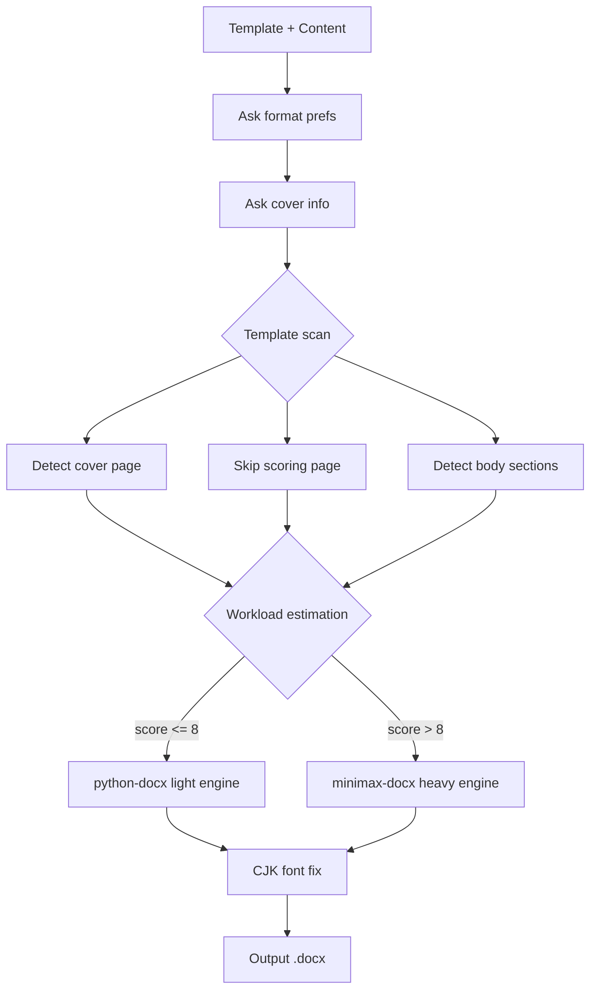

# wordhelp

Dual-engine Word document processing — **python-docx** for quick edits, **minimax-docx** for professional output.

## Quick Install

```powershell
powershell -ExecutionPolicy Bypass -File scripts\install.ps1
```

Light engine only (skip minimax-docx):
```powershell
powershell -ExecutionPolicy Bypass -File scripts\install.ps1 -Minimal
```

## Architecture



## Dependencies

| Component | Purpose | License | Install |
|-----------|---------|---------|---------|
| [python-docx](https://github.com/python-openxml/python-docx) | Light engine | MIT | Auto via install.ps1 |
| minimax-docx | Heavy engine | MIT | Codex/Trae skill marketplace |
| .NET SDK 8.0+ | minimax-docx runtime | MIT | https://dotnet.microsoft.com |
| WPS Office | .doc conversion | - | Optional |

## Copyright

Engine routing and template analysis logic partially inspired by WorkBuddy (Tencent/CodeBuddy) built-in skills.

Underlying dependencies python-docx and minimax-docx retain their original MIT licenses.

SKILL.md and all auxiliary scripts are original to this project, released under MIT.
