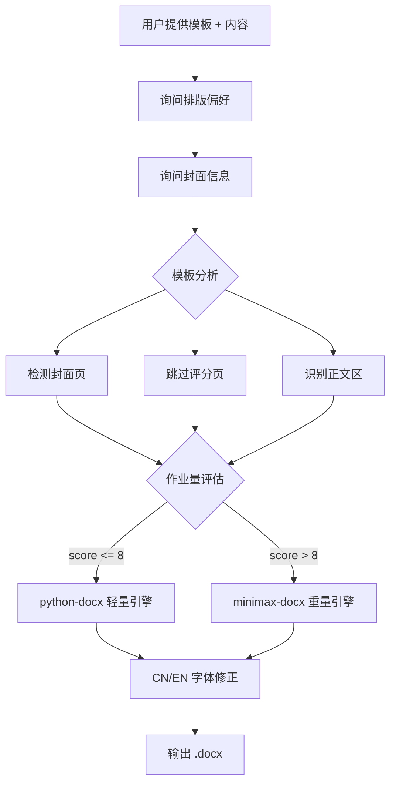

# wordhelp

双重引擎的 Word 文档处理工具——轻活快刀 **python-docx**，重活重剑 **minimax-docx**。

## 架构



## 运行效果

```console
$ powershell scripts/smoke-test.ps1
=== wordhelp Smoke Test ===
[1/3] Python + python-docx... OK (1.2.0)
[2/3] .NET SDK... OK (8.0.407)
[3/3] WPS COM... WARN (optional)
All checks passed!

$ powershell scripts/estimate-workload.ps1 -P 50 -T 5 -C 30 -Type academic
engine=minimax-docx; score=13

$ dotnet run --project MiniMaxAIDocx.Cli -- create --type report --title "wordhelp Sample"
Created report document: demo/sample-report.docx

Sections: 1 | Paragraphs: 1 | Tables: 0 | Images: 0 | Custom styles: 0
```

## 依赖

| 组件 | 用途 | 许可 |
|------|------|------|
| [python-docx](https://github.com/python-openxml/python-docx) | 轻量任务引擎 | MIT |
| [minimax-docx](https://github.com/MiniMaxAI/minimax-docx) | 重量任务引擎 | MIT |
| Python 3.10+ | 运行时 | - |
| .NET SDK 8.0+ | minimax-docx 运行时 | MIT |

## 版权声明

本项目的引擎路由策略和模板分析逻辑，部分借鉴了 WorkBuddy（Tencent/CodeBuddy）内置技能的设计思路。

底层依赖 python-docx 和 minimax-docx 均为 MIT 许可，各自保留其原始许可。

SKILL.md 及所有辅助脚本为本项目原创，基于 MIT 协议发布。

## 快速开始

```powershell
# 1. 环境检查
powershell scripts/smoke-test.ps1

# 2. 构建 minimax-docx 后端（首次使用）
powershell scripts/build-minimax.ps1

# 3. 转换 .doc 文件
powershell scripts/convert-doc.ps1 -InputPath template.doc

# 4. 修正中文/英文字体
powershell scripts/fix-cjk-fonts.ps1 -InputPath output.docx

# 5. 估算作业量并自动选引擎
powershell scripts/estimate-workload.ps1 -P 50 -T 5 -C 30 -Type academic
```
