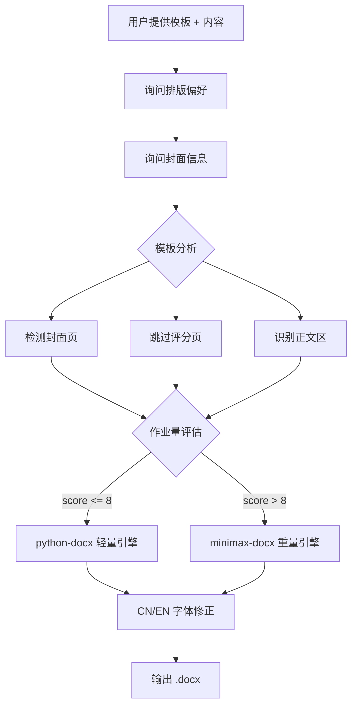

# wordhelp

双重引擎的 Word 文档处理工具——轻活快刀 **python-docx**，重活重剑 **minimax-docx**。

## 一键安装

```powershell
powershell -ExecutionPolicy Bypass -File scripts\install.ps1
```

仅轻量引擎（跳过 minimax-docx）：
```powershell
powershell -ExecutionPolicy Bypass -File scripts\install.ps1 -Minimal
```

## 架构



## 依赖

| 组件 | 用途 | 许可 | 安装方式 |
|------|------|------|----------|
| [python-docx](https://github.com/python-openxml/python-docx) | 轻量引擎 | MIT | install.ps1 自动安装 |
| minimax-docx | 重量引擎 | MIT | Codex/Trae skill 市场安装 |
| .NET SDK 8.0+ | minimax-docx 运行时 | MIT | https://dotnet.microsoft.com |
| WPS Office | .doc 转换 | - | 可选 |

## 版权声明

本项目的引擎路由策略和模板分析逻辑，部分借鉴了 WorkBuddy（Tencent/CodeBuddy）内置技能的设计思路。

底层依赖 python-docx (MIT) 和 minimax-docx (MIT)，各自保留其原始许可。

SKILL.md 及所有辅助脚本为本项目原创，基于 MIT 协议发布。
